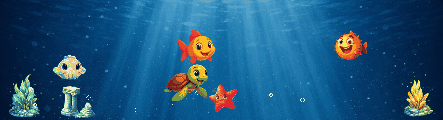
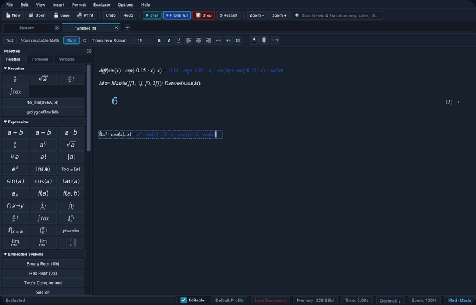

# Jacob El-Omar

  

  
  
  
  
  

<!-- Live Animated Grow A Fish Simulation Banner (Borderless) -->

  

## About Me

I am a Software Engineer and Systems Architect with a **Master of Science in Engineering (Civilingeniør, cand.polyt.) in Electronic Systems** and a **Bachelor of Science in Electronics & IT (Process Control)** from Aalborg University.

My work spans the full spectrum of software and systems engineering: bridging bare-metal silicon, real-time operating systems, and mathematical signal processing with high-performance desktop and mobile applications. Whether optimizing sub-millisecond adaptive filters on embedded ARM processors, engineering cross-platform game engines with custom native C++ audio backends, or designing desktop symbolic algebra environments, I focus on building performant, reliable, and mathematically rigorous systems.

## Flagship Products & Visual Showcase

### OpenMath — Desktop & Web Computer Algebra System (CAS)
*Co-developed with [J2KJonas](https://github.com/J2KJonas) • Python 3.10+, PyQt6, SymPy, Matplotlib MathText, WebAssembly (Pyodide)*

<table>
  <tr>
    <td width="55%" valign="top">
      
An open-source interactive computer algebra system (CAS) and technical worksheet document environment engineered for symbolic calculus, dynamic 2D graphing, matrix computations, and arbitrary precision engineering mathematics.

      

        
        
      

    </td>
    <td width="45%" align="center">
      
       <i>OpenMath Desktop: Symbolic Calculus, Dark Mode CAS, &amp; High-Precision Computing</i>
    </td>
  </tr>
</table>

---

### Grow A Fish — Production Mobile Game & Real-Time Ecosystem
*Co-developed with [J2KJonas](https://github.com/J2KJonas) • Shipped on Google Play • Flutter, Flame Engine, C++ FFI SoLoud, Supabase, Hive, X25519/AES-GCM*

<table>
  <tr>
    <td width="38%" align="center">
      
       <i>Grow A Fish: Aquarium Simulation, Match-3, Exploration, &amp; Progression</i>
    </td>
    <td width="62%" valign="top">
      
A full-stack mobile game published on Google Play combining an organic virtual aquarium simulator with 7 arcade minigames, social tank visits, and real-time multiplayer lobbies. Features 330+ Dart modules, deterministic WebSocket netcode, hardware-backed E2EE, and a zero-latency C++ <code>SoLoud</code> audio engine integrated directly via Dart FFI.

      

        
        
      

    </td>
  </tr>
</table>

---

## Applied Research & Autonomous Systems

### Medical Acoustic DSP Engine — Smart Stethoscope Platform
*Master's Thesis R&D in collaboration with Ai Health Highway & Prof. Jan Østergaard (Aalborg University)*

  

* **Adaptive Filtering Core:** Engineered real-time LMS, Normalized LMS (NLMS), and Recursive Least Squares (RLS) adaptive noise cancellation filters with FastICA blind source separation for electronic stethoscopes (**AiSteth**).
* **Clinical Performance:** Validated up to **+34 dB SNR improvement** in physical acoustic testbeds, isolating diagnostic low-frequency cardiac valve sounds (S1, S2) and respiratory acoustics under high ambient clinic noise.
* **Embedded Silicon:** Deployed on **ARM Cortex-M4**, meeting sub-millisecond execution constraints with deterministic fixed-point buffers and zero dynamic heap allocation during acquisition.

---

### Autonomous AMR Multi-Sensor Fusion & Fleet Navigation
*AAU 5G Smart Production Lab • 1st Place AAU RoboCup Winner*

  

* **Multi-Modal Sensor Fusion:** Concurrent 9-thread C++ sensor fusion engine integrating active Ultra-Wideband (UWB) RF tags, overhead Computer Vision tracking, and industrial **MiR200 Autonomous Mobile Robots**.
* **Safety & Navigation Governors:** Real-time trajectory prediction, time-to-collision safety governors, and automated velocity throttling via REST API dispatch.
* **Factory Telemetry Analytics:** High-throughput InfluxDB time-series streaming for real-time fleet analytics, positional error profiling, and latency tracking across the smart factory floor.

---

## Interactive Digital Twins Mission Control

A suite of 9 real-time mathematical digital twins, physical modeling testbenches, and interactive browser simulators. Click **Launch Simulator** to run any testbench directly in your browser:

<table width="100%">
  <tr>
    <td width="33%" valign="top">
      <h4>5G/6G RF Channel Studio</h4>
      
<b>Domain:</b> RF &amp; Telecommunications

      
TDL fading channels, Clarke/Jakes Doppler spectrum, 256-QAM constellation, and EVM distortion analysis.

      

        
        
      

    </td>
    <td width="33%" valign="top">
      <h4>CubeSat AOCS Flight Sim</h4>
      
<b>Domain:</b> Aerospace Systems

      
4th-order Runge-Kutta (RK4) orbit integration, quaternion attitude kinematics, and B-dot magnetic detumbling.

      

        
        
      

    </td>
    <td width="33%" valign="top">
      <h4>Industrial SCADA Process Twin</h4>
      
<b>Domain:</b> Industrial Automation

      
ISA-101 high-performance HMI, IEC 61131-3 Structured Text logic engine, and Modbus TCP telemetry.

      

        
        
      

    </td>
  </tr>
  <tr>
    <td width="33%" valign="top">
      <h4>Hearing Aid DSP Studio</h4>
      
<b>Domain:</b> Audio &amp; Acoustic DSP

      
Head shadow diffraction modeling, NLMS acoustic feedback cancellation, and 6-band WDRC dynamic compression.

      

        
        
      

    </td>
    <td width="33%" valign="top">
      <h4>Wind Turbine Load Control</h4>
      
<b>Domain:</b> Clean Energy &amp; Power

      
15 MW offshore aeroelastic modeling, Coleman multi-blade coordinate (MBC) transforms, and IPC pitch regulation.

      

        
        
      

    </td>
    <td width="33%" valign="top">
      <h4>PMSM Field-Oriented Control</h4>
      
<b>Domain:</b> Electric Drives &amp; Motion

      
Clarke/Park coordinate transforms, Space Vector PWM (SVPWM), and sliding mode observer (SMO) flux estimation.

      

        
        
      

    </td>
  </tr>
  <tr>
    <td width="33%" valign="top">
      <h4>Pump Hydrodynamics Twin</h4>
      
<b>Domain:</b> Fluid Systems &amp; Maintenance

      
Affinity laws, Thoma cavitation factor analysis, and motor current signature analysis (MCSA) stator FFT.

      

        
        
      

    </td>
    <td width="33%" valign="top">
      <h4>Naval Radar Signal Studio</h4>
      
<b>Domain:</b> Defense &amp; Radar Systems

      
Cell-Averaging (CA-CFAR) and Ordered-Statistic (OS-CFAR) detection with 3-pulse MTI clutter rejection.

      

        
        
      

    </td>
    <td width="33%" valign="top">
      <h4>Cobot Kinematics &amp; Momentum</h4>
      
<b>Domain:</b> Industrial Robotics

      
6-DOF UR5e forward/inverse kinematics, Damped Least-Squares (DLS) singularity solver, and ISO/TS 15066 safety envelopes.

      

        
        
      

    </td>
  </tr>
</table>

## Technical Skills Matrix

### Core Programming Languages
)

[-1B365D?style=for-the-badge)](https://en.wikipedia.org/wiki/Structured_text)

### Frameworks, Engines & Real-Time Kernels

### Embedded, Industrial Hardware & Protocols

### Cloud, EDA, Tooling & DevOps

## Education

* **M.Sc. in Engineering — Electronic Systems (Civilingeniør, cand.polyt.)**  
  Aalborg University (2023 – 2025) • 120 ECTS  
  *Focus on Advanced Signal Processing, Control Engineering, Spacecraft Dynamics, and Real-Time Systems.*

* **B.Sc. in Engineering — Electronics & IT (Process Control Specialization)**  
  Aalborg University (2020 – 2023) • 180 ECTS  
  *Focus on Closed-Loop Control, Industrial Automation, Digital Hardware (VHDL/FPGA), and Embedded Software.*

## Contact

  
  
  

