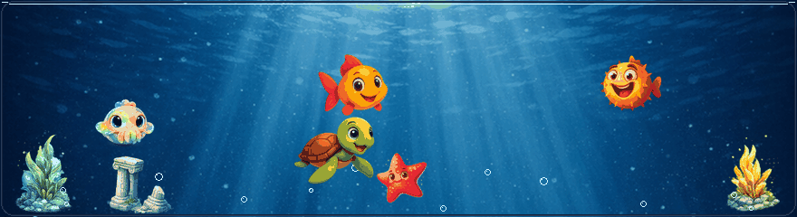

# Jacob El-Omar

  

  
  
  
  
  

<!-- Live Animated Grow A Fish Simulation Banner -->

  

---

## Engineering Profile & Core Highlights

<table width="100%">
  <tr>
    <td width="50%" valign="top">
      <h4>Full-Stack Software &amp; Systems Architecture</h4>
      
<b>M.Sc. (Civilingeniør, cand.polyt.) in Electronic Systems</b> and <b>B.Sc. in Electronics &amp; IT (Process Control)</b> from Aalborg University. Bridges the complete engineering lifecycle from bare-metal silicon registers, real-time operating systems, and industrial protocols up to high-performance desktop and mobile applications.

      

        
        
        
      

    </td>
    <td width="50%" valign="top">
      <h4>Production Mobile &amp; Desktop Engines</h4>
      
Shipped <b>Grow A Fish</b> on Google Play featuring 330+ Dart modules, zero-lag C++ <code>SoLoud</code> audio engine integration via Dart FFI, deterministic WebSocket multiplayer netcode, and hardware-backed E2EE. Co-developed <b>OpenMath</b>, a cross-platform desktop CAS and technical worksheet environment.

      

        
        
        
      

    </td>
  </tr>
  <tr>
    <td width="50%" valign="top">
      <h4>Medical DSP &amp; Signal Intelligence</h4>
      
50 ECTS Master's Thesis R&D in collaboration with <b>Ai Health Highway</b>. Engineered real-time adaptive noise cancellation filters (LMS, NLMS, RLS) and FastICA for smart electronic stethoscopes (<b>AiSteth</b>), achieving up to <b>+34 dB SNR improvements</b> with deterministic sub-millisecond execution targets on ARM Cortex-M4.

      

        
        
        
      

    </td>
    <td width="50%" valign="top">
      <h4>Autonomous Robotics &amp; Industrial Control</h4>
      
<b>1st Place Champion in AAU RoboCup Tournament</b>. Engineered a 9-thread concurrent Python sensor fusion engine fusing active Ultra-Wideband (UWB) RF tags, overhead Computer Vision, and industrial <b>MiR200 AMRs</b>. Designed discrete anti-sway LQR gantry crane control and implemented IEC 61131-3 logic on FPGA/PSoC.

      

        
        
        
      

    </td>
  </tr>
</table>

---

## Flagship Products & Visual Showcase

### OpenMath — Desktop & Web Computer Algebra System (CAS)
*Co-developed with [J2KJonas](https://github.com/J2KJonas) • Python 3.10+, PyQt6, SymPy, Matplotlib MathText, WebAssembly (Pyodide)*

<table>
  <tr>
    <td width="55%" valign="top">
      
An open-source interactive computer algebra system (CAS) and technical worksheet document environment designed for symbolic computation, dynamic graphing, and engineering mathematics.

      

        
        
      

      

        
        
        
        
        
      

      <ul>
        <li><b>Stateful Symbolic Engine:</b> Hierarchical section folding (<code>1. Section</code>, <code>1.1 Subsection</code>) with continuous visual scope brackets.</li>
        <li><b>Arbitrary Precision:</b> Exact-to-decimal toggles from 2 to 50 digits of precision.</li>
        <li><b>Embedded Hardware Suite:</b> Bitwise logic masks, Q-format fixed-point conversion (<code>to_q</code>, <code>from_q</code>), and IEEE-754 bit decomposition.</li>
      </ul>
    </td>
    <td width="45%" align="center">
      
       <i>OpenMath Academic Light Theme with Dynamic 2D Plotter &amp; Matrix Wizard</i>
        
      
    </td>
  </tr>
</table>

---

### Grow A Fish — Production Mobile Game & Real-Time Ecosystem
*Co-developed with [J2KJonas](https://github.com/J2KJonas) • Shipped on Google Play • Flutter, Flame Engine, C++ FFI SoLoud, Supabase, Hive, X25519/AES-GCM*

<table>
  <tr>
    <td width="38%" align="center">
      
       <i>Live Aquarium Simulation &amp; Multi-Genre Arcade Engine</i>
    </td>
    <td width="62%" valign="top">
      
A full-stack mobile game published on Google Play combining an organic virtual aquarium simulator with 7 arcade minigames, social tank visits, and real-time multiplayer lobbies.

      

        
        
      

      

        
        
        
        
        
      

      <ul>
        <li><b>Zero-Lag Audio Engine:</b> Bypassed Android platform-channel latency by integrating the C++ <code>SoLoud</code> audio engine directly via Dart FFI with custom LRU caching.</li>
        <li><b>Deterministic Netcode:</b> 64-bit seed-synchronized procedural level generation over WebSockets, eliminating cellular multiplayer jitter.</li>
        <li><b>Hardware-Backed E2EE Chat:</b> Client-side X25519 ECDH key exchange with AES-256-GCM authenticated encryption backed by Android Keystore / iOS Keychain.</li>
      </ul>
    </td>
  </tr>
</table>

---

### Applied Research & Autonomous Systems

<table width="100%">
  <tr>
    <td width="50%" valign="top">
      <h4>Medical Acoustic DSP Engine</h4>
      
<i>Master's Thesis R&D w/ Ai Health Highway &amp; Prof. Jan Østergaard (AAU)</i>

      

        
        
        
      

      

        
        
        
      

      <ul>
        <li><b>Clinical Diagnostic Audio:</b> Real-time noise cancellation for smart electronic stethoscopes (<b>AiSteth</b>) under clinical diagnostic constraints.</li>
        <li><b>Empirical Validation:</b> Validated up to <b>+34 dB SNR improvement</b> in physical acoustic testbeds while preserving low-frequency cardiac valve sounds (S1, S2).</li>
        <li><b>DSP Formulations:</b> STFT spectral tracking, adaptive filtering (NLMS/RLS), and statistical blind source separation.</li>
      </ul>
    </td>
    <td width="50%" valign="top">
      <h4>Autonomous Robotics &amp; Fleet Navigation</h4>
      
<i>AAU 5G Smart Production Lab • 1st Place AAU RoboCup Winner</i>

      

        
        
        
      

      

        
        
        
      

      <ul>
        <li><b>Multi-Sensor Fusion:</b> 9-thread concurrent Python engine fusing active Ultra-Wideband (UWB) RF tags, overhead vision, and AMR telemetry.</li>
        <li><b>Collision Governor:</b> Trajectory prediction, time-to-collision safety horizons, and automated REST API velocity throttling for industrial AMRs.</li>
        <li><b>Statistical Validation:</b> Full spatial telemetry ingestion into InfluxDB v2 with empirical Cumulative Distribution Function (CDF) accuracy analysis.</li>
      </ul>
    </td>
  </tr>
</table>

---

## Interactive Digital Twins Mission Control

A suite of 9 real-time mathematical digital twins, physical modeling testbenches, and interactive browser simulators. Click **Launch Simulator** to test directly in your browser:

| Domain | Digital Twin & Architecture | Mathematical Models & Algorithms | Mission Control |
| :--- | :--- | :--- | :--- |
| **RF / Telecom** | **5G/6G RF Channel Studio** | TDL Fading, Clarke/Jakes Doppler, 256-QAM, EVM | [Launch Simulator](https://elomarjc.github.io/5g-rf-channel-studio/) • [Source](https://github.com/elomarjc/5g-rf-channel-studio) |
| **Aerospace** | **CubeSat AOCS Flight Simulator** | RK4 orbit integration, quaternion kinematics, B-dot | [Launch Simulator](https://elomarjc.github.io/cubesat-aocs-simulator/) • [Source](https://github.com/elomarjc/cubesat-aocs-simulator) |
| **Automation** | **Industrial SCADA & Process Twin** | ISA-101 HMI, IEC 61131-3 Structured Text, Modbus TCP | [Launch Simulator](https://elomarjc.github.io/industrial-scada-digital-twin/) • [Source](https://github.com/elomarjc/industrial-scada-digital-twin) |
| **Audio DSP** | **Hearing Aid Adaptive Beamforming** | Head shadow diffraction, NLMS cancellation, 6-band WDRC | [Launch Simulator](https://elomarjc.github.io/hearing-aid-dsp-studio/) • [Source](https://github.com/elomarjc/hearing-aid-dsp-studio) |
| **Clean Energy** | **Wind Turbine Load Control Twin** | 15 MW offshore turbine, Coleman MBC, Pitch Control | [Launch Simulator](https://elomarjc.github.io/turbine-load-control-twin/) • [Source](https://github.com/elomarjc/turbine-load-control-twin) |
| **Power Drives** | **PMSM Field-Oriented Control (FOC)** | Clarke/Park transforms, Space Vector PWM, SMO observer | [Launch Simulator](https://elomarjc.github.io/pmsm-foc-drive-twin/) • [Source](https://github.com/elomarjc/pmsm-foc-drive-twin) |
| **Hydrodynamics**| **Industrial Pump Hydrodynamics** | Affinity Laws, Thoma cavitation factor, MCSA stator FFT | [Launch Simulator](https://elomarjc.github.io/pump-hydrodynamics-digital-twin/) • [Source](https://github.com/elomarjc/pump-hydrodynamics-digital-twin) |
| **Defense / Radar**| **Naval Radar CFAR & Doppler Studio** | CA/OS-CFAR detection, 3-pulse MTI clutter filter | [Launch Simulator](https://elomarjc.github.io/naval-radar-signal-studio/) • [Source](https://github.com/elomarjc/naval-radar-signal-studio) |
| **Robotics** | **Cobot Kinematics & Momentum Twin** | 6-DOF UR5e arm, Damped Least-Squares solver, ISO/TS 15066 | [Launch Simulator](https://elomarjc.github.io/cobot-kinematics-momentum-twin/) • [Source](https://github.com/elomarjc/cobot-kinematics-momentum-twin) |

---

## Technical Skills Matrix

### Core Programming Languages
)

[-1B365D?style=for-the-badge)](https://en.wikipedia.org/wiki/Structured_text)

### Frameworks, Engines & Real-Time Kernels

### Embedded, Industrial Hardware & Protocols

### Cloud, EDA, Tooling & DevOps

---

## Education

* **M.Sc. in Engineering — Electronic Systems (Civilingeniør, cand.polyt.)**  
  Aalborg University (2023 – 2025) • 120 ECTS  
  *Focus on Advanced Signal Processing, Control Engineering, Spacecraft Dynamics, and Real-Time Systems.*

* **B.Sc. in Engineering — Electronics & IT (Process Control Specialization)**  
  Aalborg University (2020 – 2023) • 180 ECTS  
  *Focus on Closed-Loop Control, Industrial Automation, Digital Hardware (VHDL/FPGA), and Embedded Software.*

---

## Contact

  
  
  

