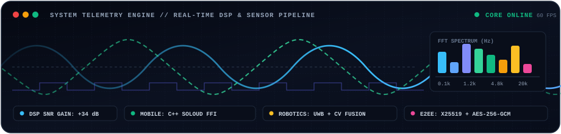
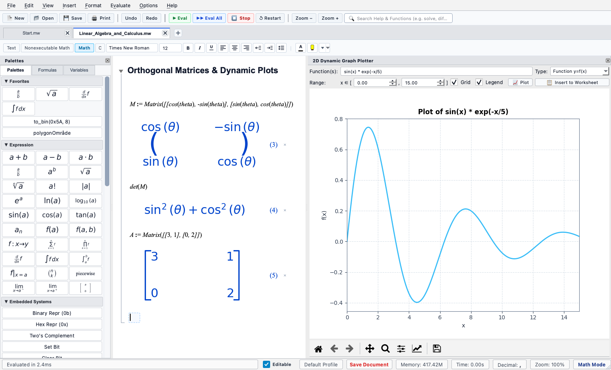

<div align="center">

# Jacob El-Omar

<a href="https://github.com/elomarjc">
  
</a>

<p align="center">
  <a href="https://www.linkedin.com/in/jacob-el-omar/"></a>
  <a href="https://github.com/elomarjc"></a>
  <a href="https://play.google.com/store/apps/details?id=com.elomarstudio.growafish"></a>
  <a href="mailto:elomarjc@gmail.com"></a>
  <a href="https://maps.google.com/?q=Aalborg,+Denmark"></a>
</p>

<!-- Live Animated Signal & Telemetry Monitor -->
<p align="center">
  
</p>

</div>

---

## Interactive Workstation Console

<details open>
<summary><b>▶ Terminal: <code>jacob --status --overview</code></b> <i>(Click to expand/collapse system profile)</i></summary>

```text
┌──[guest@jacob-workstation]─[~]
└──$ jacob --status --overview
[● ONLINE     ] Jacob El-Omar — M.Sc. in Electronic Systems | Aalborg University, Denmark
[● DISCIPLINES] Full-Stack Software • Mobile Engines • Medical AI/ML & DSP • Robotics
[● CO-DEV     ] OpenMath CAS (Desktop + Web) & Grow A Fish (Google Play) w/ @J2KJonas
[● PERFORMANCE] +34 dB Medical Audio SNR | Sub-1ms Binary Chunks | Zero-Lag C++ Audio FFI
[● ARCHITECTURE] 330+ Dart Modules | 9 Real-Time Digital Twins | FreeRTOS & Cyclone V FPGA
```

</details>

<details>
<summary><b>▶ Terminal: <code>jacob --skills --matrix</code></b> <i>(Click to view full stack & tooling breakdown)</i></summary>

```text
┌──[guest@jacob-workstation]─[~]
└──$ jacob --skills --matrix
LANGUAGES       :: Python, C/C++, Dart, C#/.NET Core, TypeScript/JavaScript, VHDL, SQL, MATLAB
FRAMEWORKS      :: PyQt6, Flutter, Flame Engine, Dart FFI (Native C++), Streamlit, Node.js
AI / ML & DSP   :: Adaptive Filtering (LMS/NLMS/RLS), FastICA, STFT, RapidOCR, LLM APIs / Ollama
ROBOTICS / CTRL :: Mobile Robots (MiR200), State-Space MIMO, Cascaded PID, LQR/LQG, Kalman (EKF/UKF)
EMBEDDED / IOT  :: FreeRTOS, ARM Cortex-M, Intel Cyclone V FPGA, ESP32, ATmega2560, Modbus, MQTT
DATA / CLOUD    :: Supabase Realtime, PostgreSQL, InfluxDB v2, Hive NoSQL, Docker, Git, CI/CD
```

</details>

<details>
<summary><b>▶ Terminal: <code>jacob --achievements --awards</code></b> <i>(Click to view honors and milestones)</i></summary>

```text
┌──[guest@jacob-workstation]─[~]
└──$ jacob --achievements --awards
[★ 1ST PLACE ] AAU RoboCup Autonomous Robotics Tournament Champion
[★ MASTER'S  ] 50 ECTS Thesis R&D with Ai Health Highway: Real-Time Adaptive Noise Cancellation (+34dB SNR)
[★ SHIPPED   ] Grow A Fish: Commercial Mobile Game & Real-Time Multiplayer Ecosystem on Google Play
[★ HARDWARE  ] Full PLC IEC 61131-3 Equivalence on Cypress PSoC 5LP UDBs & Intel Cyclone V FPGA
```

</details>

---

## Flagship Products & Visual Showcase

### OpenMath — Desktop & Web Computer Algebra System (CAS)
*Co-developed with [J2KJonas](https://github.com/J2KJonas) • Python 3.10+, PyQt6, SymPy, Matplotlib MathText, WebAssembly (Pyodide)*

<table>
  <tr>
    <td width="55%" valign="top">
      <p>An open-source interactive computer algebra system (CAS) and technical worksheet document environment designed for symbolic computation, dynamic graphing, and engineering mathematics.</p>
      <p>
        <a href="https://j2kjonas.github.io/OpenMath/"></a>
        <a href="https://github.com/J2KJonas/OpenMath"></a>
      </p>
      <p>
        
        
        
        
        
      </p>
      <ul>
        <li><b>Stateful Symbolic Engine:</b> Hierarchical section folding (<code>1. Section</code>, <code>1.1 Subsection</code>) with continuous visual scope brackets.</li>
        <li><b>Arbitrary Precision:</b> Exact-to-decimal toggles from 2 to 50 digits of precision.</li>
        <li><b>Embedded Hardware Suite:</b> Bitwise logic masks, Q-format fixed-point conversion (<code>to_q</code>, <code>from_q</code>), and IEEE-754 bit decomposition.</li>
      </ul>
    </td>
    <td width="45%" align="center">
      <a href="https://github.com/J2KJonas/OpenMath">
        
      </a>
      <br/><sub><i>OpenMath Academic Light Theme with Dynamic 2D Plotter &amp; Matrix Wizard</i></sub>
    </td>
  </tr>
</table>

---

### Grow A Fish — Production Mobile Game & Real-Time Ecosystem
*Co-developed with [J2KJonas](https://github.com/J2KJonas) • Shipped on Google Play • Flutter, Flame Engine, C++ FFI SoLoud, Supabase, Hive, X25519/AES-GCM*

<table>
  <tr>
    <td width="38%" align="center">
      <a href="https://github.com/elomarjc/grow-a-fish-case-study">
        
      </a>
      <br/><sub><i>Live Aquarium Simulation &amp; Multi-Genre Arcade Engine</i></sub>
    </td>
    <td width="62%" valign="top">
      <p>A full-stack mobile game published on Google Play combining an organic virtual aquarium simulator with 7 arcade minigames, social tank visits, and real-time multiplayer lobbies.</p>
      <p>
        <a href="https://play.google.com/store/apps/details?id=com.elomarstudio.growafish"></a>
        <a href="https://github.com/elomarjc/grow-a-fish-case-study"></a>
      </p>
      <p>
        
        
        
        
        
      </p>
      <ul>
        <li><b>Zero-Lag Audio Engine:</b> Bypassed Android platform-channel latency by integrating the C++ <code>SoLoud</code> audio engine directly via Dart FFI with custom LRU caching.</li>
        <li><b>Deterministic Netcode:</b> 64-bit seed-synchronized procedural level generation over WebSockets, eliminating cellular multiplayer jitter.</li>
        <li><b>Hardware-Backed E2EE Chat:</b> Client-side X25519 ECDH key exchange with AES-256-GCM authenticated encryption backed by Android Keystore / iOS Keychain.</li>
      </ul>
    </td>
  </tr>
</table>

---

### Medical Acoustic Signal Enhancement — Master's Thesis R&D
*Master's Thesis in collaboration with Ai Health Highway & Prof. Jan Østergaard (AAU) • Python, MATLAB, LMS/NLMS/RLS, FastICA, STFT*

<p>
  <a href="https://github.com/elomarjc/adaptive-noise-cancellation-dsp"></a>
  
  
</p>

* **Clinical Acoustic R&D**: Developed real-time signal enhancement algorithms for smart electronic stethoscopes (**AiSteth**) to cancel ambient hospital interference under clinical diagnostic constraints.
* **Algorithm Formulations**: Implemented and benchmarked Least Mean Squares (LMS), Normalized LMS (NLMS), Recursive Least Squares (RLS), and FastICA Blind Source Separation.
* **Empirical Validation**: Achieved up to **+34 dB SNR improvements** across physical acoustic chamber testbeds while preserving crucial low-frequency cardiac valve sounds ($S_1, S_2$) and murmurs.

---

### Indoor Positioning & AMR Fleet Integration
*AAU 5G Smart Production Lab • Autonomous Robotics & Sensor Fusion • 1st Place AAU RoboCup Winner*

<p>
  <a href="https://github.com/elomarjc/indoor-positioning-amr-integration"></a>
  
  
</p>

* **Multi-Sensor Fusion**: Engineered a 9-thread concurrent Python processing engine fusing real-time spatial telemetry from active Ultra-Wideband (UWB) RF tags, overhead Computer Vision tracking, and Autonomous Mobile Robots (MiR200).
* **Predictive Collision Avoidance**: Implemented trajectory prediction, time-to-collision calculation, and dynamic velocity throttling to govern robot navigation over REST APIs.
* **Telemetry & Analytics**: Integrated InfluxDB v2 time-series storage and generated empirical Cumulative Distribution Function (CDF) positioning accuracy models.

---

## Interactive Digital Twins Mission Control

A suite of 9 real-time mathematical digital twins, physical modeling testbenches, and interactive browser simulators. Click **Launch Simulator** to test directly in your browser:

| Domain | Digital Twin & Architecture | Mathematical Models & Algorithms | Mission Control |
| :--- | :--- | :--- | :--- |
| **RF / Telecom** | **5G/6G RF Channel Studio** | TDL Fading, Clarke/Jakes Doppler, 256-QAM, EVM | [Launch Simulator](https://elomarjc.github.io/5g-rf-channel-studio/) • [Source](https://github.com/elomarjc/5g-rf-channel-studio) |
| **Aerospace** | **CubeSat AOCS Flight Simulator** | RK4 orbit integration, quaternion kinematics, B-dot | [Launch Simulator](https://elomarjc.github.io/cubesat-aocs-simulator/) • [Source](https://github.com/elomarjc/cubesat-aocs-simulator) |
| **Automation** | **Industrial SCADA & Process Twin** | ISA-101 HMI, IEC 61131-3 Structured Text, Modbus TCP | [Launch Simulator](https://elomarjc.github.io/industrial-scada-digital-twin/) • [Source](https://github.com/elomarjc/industrial-scada-digital-twin) |
| **Audio DSP** | **Hearing Aid Adaptive Beamforming** | Head shadow diffraction, NLMS cancellation, 6-band WDRC | [Launch Simulator](https://elomarjc.github.io/hearing-aid-dsp-studio/) • [Source](https://github.com/elomarjc/hearing-aid-dsp-studio) |
| **Clean Energy** | **Wind Turbine Load Control Twin** | 15 MW offshore turbine, Coleman MBC, Pitch Control | [Launch Simulator](https://elomarjc.github.io/turbine-load-control-twin/) • [Source](https://github.com/elomarjc/turbine-load-control-twin) |
| **Power Drives** | **PMSM Field-Oriented Control (FOC)** | Clarke/Park transforms, Space Vector PWM, SMO observer | [Launch Simulator](https://elomarjc.github.io/pmsm-foc-drive-twin/) • [Source](https://github.com/elomarjc/pmsm-foc-drive-twin) |
| **Hydrodynamics**| **Industrial Pump Hydrodynamics** | Affinity Laws, Thoma cavitation factor, MCSA stator FFT | [Launch Simulator](https://elomarjc.github.io/pump-hydrodynamics-digital-twin/) • [Source](https://github.com/elomarjc/pump-hydrodynamics-digital-twin) |
| **Defense / Radar**| **Naval Radar CFAR & Doppler Studio** | CA/OS-CFAR detection, 3-pulse MTI clutter filter | [Launch Simulator](https://elomarjc.github.io/naval-radar-signal-studio/) • [Source](https://github.com/elomarjc/naval-radar-signal-studio) |
| **Robotics** | **Cobot Kinematics & Momentum Twin** | 6-DOF UR5e arm, Damped Least-Squares solver, ISO/TS 15066 | [Launch Simulator](https://elomarjc.github.io/cobot-kinematics-momentum-twin/) • [Source](https://github.com/elomarjc/cobot-kinematics-momentum-twin) |

---

## Technical Skills Matrix

<div align="center">

### Languages & Systems Core
[](https://isocpp.org/)
[](https://python.org/)
[](https://dart.dev/)
[](https://docs.microsoft.com/en-us/dotnet/csharp/)
[](https://www.typescriptlang.org/)
[](https://en.wikipedia.org/wiki/VHDL)
[](https://mathworks.com/)
[](https://www.postgresql.org/)

### Frameworks, Engines & Real-Time Systems
[](https://flutter.dev/)
[](https://riverbankcomputing.com/software/pyqt/)
[](https://flame-engine.org/)
[](https://www.freertos.org/)
[](https://nodejs.org/)
[](https://streamlit.io/)

### Hardware, Cloud & Infrastructure
[](https://www.intel.com/)
[](https://www.arm.com/)
[](https://supabase.com/)
[](https://www.docker.com/)
[](https://www.kernel.org/)
[](https://git-scm.com/)

</div>

---

## Education

* **M.Sc. in Engineering — Electronic Systems (Civilingeniør, cand.polyt.)**  
  Aalborg University (2023 – 2025) • 120 ECTS  
  *Focus on Advanced Signal Processing, Control Engineering, Spacecraft Dynamics, and Real-Time Systems.*

* **B.Sc. in Engineering — Electronics & IT (Process Control Specialization)**  
  Aalborg University (2020 – 2023) • 180 ECTS  
  *Focus on Closed-Loop Control, Industrial Automation, Digital Hardware (VHDL/FPGA), and Embedded Software.*

---

## Contact

<p align="center">
  <a href="mailto:elomarjc@gmail.com"></a>
  <a href="https://www.linkedin.com/in/jacob-el-omar/"></a>
  <a href="https://github.com/elomarjc"></a>
</p>
